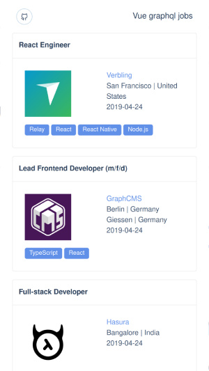
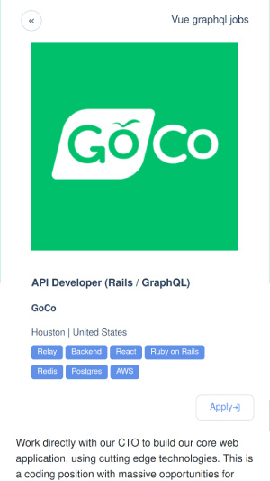

# vue-jobs-graphql

With this application, you can easily browse through the graphql related programming jobs. Job offers come from [graphql jobs api](https://graphql.jobs/).


jobs list            |  job details
:-------------------------:|:-------------------------:
  |  

## Build with

 * [Vue.js](https://vuejs.org/)
 * [Vue Apollo](https://apollo.vuejs.org/)
 * [AT-UI](https://at-ui.github.io/at-ui/#/en)

## Project setup
```
yarn install
```

### Compiles and hot-reloads for development
```
yarn serve
```

### Compiles and minifies for production
```
yarn build
```

### Customize configuration
See [Configuration Reference](https://cli.vuejs.org/config/).